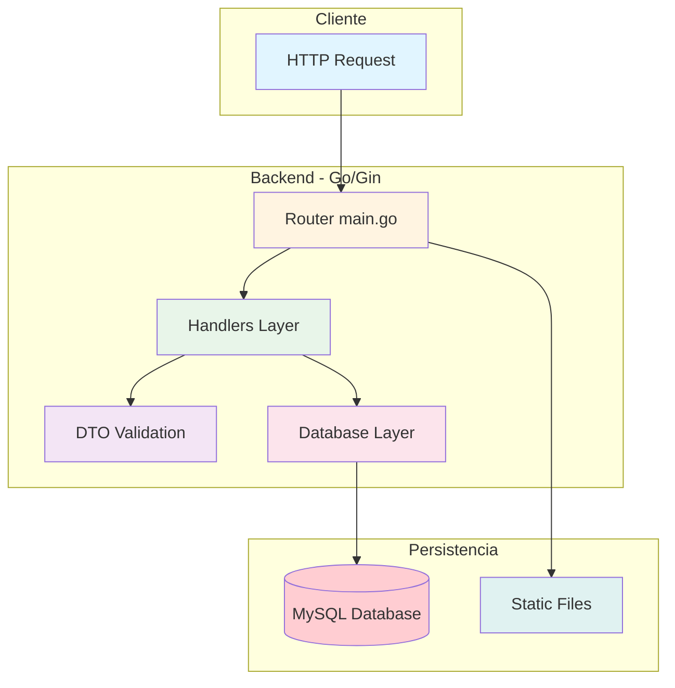

# 🚀 Fullstack Application

<div align="center">


*Una aplicación fullstack moderna con API RESTful en Go y frontend interactivo*

[Demo](#) • [Documentación](#-documentación) • [Reportar Bug](../../issues) • [Solicitar Feature](../../issues)

</div>

---

## 📖 Índice

- [Sobre el Proyecto](#-sobre-el-proyecto)
- [Stack Tecnológico](#️-stack-tecnológico)
- [Estructura del Proyecto](#-estructura-del-proyecto)
- [Inicio Rápido](#-inicio-rápido)
- [Documentación](#-documentación)
  - [Backend](#-backend-api)
  - [Frontend](#-frontend-coming-soon)
- [Desarrollo](#-desarrollo)
- [Características](#-características)
- [Roadmap](#-roadmap)
- [Contribuir](#-contribuir)
- [Licencia](#-licencia)
- [Contacto](#-contacto)

---

## 🎯 Sobre el Proyecto

Esta es una aplicación fullstack completa que incluye:

- **Backend API RESTful** construida con Go y Gin Framework
- **Base de datos MySQL** con ORM GORM
- **Frontend moderno** *(próximamente)*
- **Arquitectura escalable** y mantenible
- **Hot reload** para desarrollo ágil

### ¿Qué hace esta aplicación?

Proporciona una base sólida para aplicaciones web modernas con operaciones CRUD completas, autenticación, gestión de archivos y más.

---

## 🛠️ Stack Tecnológico

### Backend

<table>
<tr>
<td align="center" width="96">

<br>Go
</td>
<td align="center" width="96">

<br>Gin
</td>
<td align="center" width="96">

<br>GORM
</td>
<td align="center" width="96">

<br>MySQL
</td>
<td align="center" width="96">

<br>Air
</td>
</tr>
</table>

- **Lenguaje:** Go 1.24.0
- **Framework Web:** Gin 1.11.0
- **ORM:** GORM
- **Base de Datos:** MySQL 8.0
- **Hot Reload:** Air
- **Gestión de Env:** GoDotEnv

### Frontend
> 🚧 **Coming Soon** - Se documentará cuando esté implementado

---

## 📁 Estructura del Proyecto

```
fullstack-app/
├── 📂 backend/                 # Aplicación backend en Go
│   ├── 📂 database/            # Configuración de base de datos
│   │   └── database.go         # Conexión GORM a MySQL
│   ├── 📂 dto/                 # Data Transfer Objects
│   │   └── dto.go              # Estructuras de validación
│   ├── 📂 handlers/            # Controladores HTTP
│   │   └── example.go          # Handlers de ejemplo
│   ├── 📂 public/              # Archivos estáticos
│   │   └── uploads/images/     # Imágenes subidas
│   ├── 📂 tmp/                 # Temporales de Air
│   ├── 📄 .air.toml            # Configuración hot reload
│   ├── 📄 .env                 # Variables de entorno (local)
│   ├── 📄 go.mod               # Dependencias Go
│   ├── 📄 go.sum               # Checksums
│   ├── 📄 main.go              # Punto de entrada
│   └── 📄 README.md            # Documentación backend
├── 📂 frontend/                # Aplicación frontend (próximamente)
├── 📄 .gitignore               # Archivos ignorados por Git
├── 📄 LICENSE                  # Licencia MIT
└── 📄 README.md                # Este archivo
```

---

## ⚡ Inicio Rápido

### Requisitos Previos

Asegúrate de tener instalado:

- [Go](https://golang.org/dl/) >= 1.24.0
- [MySQL](https://dev.mysql.com/downloads/) >= 8.0
- [Git](https://git-scm.com/)
- [Air](https://github.com/air-verse/air) (opcional, recomendado)

### Instalación

#### 1️⃣ Clonar el repositorio

```bash
git clone https://github.com/jjmartinmelero/fullstack-app.git
cd fullstack-app
```

#### 2️⃣ Configurar Backend

```bash
cd backend

# Instalar dependencias
go mod download

# Crear archivo .env
cp .env.example .env
# Edita .env con tus credenciales de MySQL
```

**Configuración `.env`:**

```env
DB_HOST=localhost
DB_PORT=3306
DB_USER=tu_usuario
DB_PASSWORD=tu_contraseña
DB_NAME=nombre_base_datos
```

#### 3️⃣ Ejecutar el Backend

**Con Air (desarrollo con hot reload):**
```bash
air
```

**Sin Air (modo estándar):**
```bash
go run main.go
```

El servidor estará disponible en: **http://localhost:1024**

#### 4️⃣ Configurar Frontend
> 🚧 **Próximamente** - Se agregará cuando el frontend esté implementado

---

## 📚 Documentación

### 🔧 Backend API

#### Endpoints Disponibles

**Base URL:** `http://localhost:1024/api/v1/`

| Método | Endpoint | Descripción | Body |
|--------|----------|-------------|------|
| `GET` | `/` | Mensaje de bienvenida | - |
| `GET` | `/api/v1/example` | Obtener ejemplo | - |
| `GET` | `/api/v1/example/:id` | Obtener por ID | - |
| `POST` | `/api/v1/example` | Crear ejemplo | `{email, password}` |
| `PUT` | `/api/v1/example/:id` | Actualizar por ID | - |
| `DELETE` | `/api/v1/example/:id` | Eliminar por ID | - |
| `GET` | `/api/v1/example/querystring` | Query params | `?id=123` |
| `POST` | `/api/v1/example/upload` | Subir imagen | `multipart/form-data` |

#### Ejemplo de Uso

**GET - Obtener ejemplo:**
```bash
curl http://localhost:1024/api/v1/example
```

**POST - Crear ejemplo:**
```bash
curl -X POST http://localhost:1024/api/v1/example \
  -H "Content-Type: application/json" \
  -d '{
    "email": "usuario@ejemplo.com",
    "password": "contraseña123"
  }'
```

**POST - Subir imagen:**
```bash
curl -X POST http://localhost:1024/api/v1/example/upload \
  -F "photo=@/ruta/a/imagen.jpg"
```

#### Respuestas de la API

**Éxito (200/201):**
```json
{
  "status": "OK",
  "message": "Operación exitosa",
  "data": { }
}
```

**Error (400/404/422):**
```json
{
  "status": "ERROR",
  "message": "Descripción del error"
}
```

#### Arquitectura Backend



**📖 [Ver documentación completa del Backend](backend/README.md)**

---

### 🎨 Frontend *(Coming Soon)*

> 🚧 **En desarrollo** - La documentación del frontend se agregará próximamente.

#### Tecnologías Planificadas

- Framework moderno (React/Vue/Angular)
- Estado global
- Estilizado moderno
- Responsive design
- Integración con Backend API

---

## 👨‍💻 Desarrollo

### Flujo de Trabajo

#### Backend Development

1. **Iniciar servidor de desarrollo:**
   ```bash
   cd backend
   air
   ```

2. **Hacer cambios en el código** - Air recargará automáticamente

3. **Probar endpoints:**
   ```bash
   # Instalar herramientas de prueba
   # Postman, Insomnia, o curl
   ```

#### Frontend Development
> 🚧 Se documentará cuando esté disponible

### Convenciones de Código

#### Backend (Go)
- **Archivos:** `snake_case.go`
- **Funciones:** `PascalCase` con prefijos descriptivos
- **Variables:** `camelCase`
- **Constantes:** `UPPER_SNAKE_CASE`
- **Paquetes:** `lowercase`

#### Frontend
> 🚧 Se definirán cuando se implemente

---

## ✨ Características

### ✅ Implementadas

- [x] API RESTful completa con operaciones CRUD
- [x] Validación robusta de datos en requests
- [x] Upload de archivos con gestión de imágenes
- [x] Conexión a MySQL con GORM ORM
- [x] Variables de entorno para configuración segura
- [x] Hot reload con Air para desarrollo
- [x] Arquitectura modular y escalable
- [x] Manejo consistente de errores
- [x] Servicio de archivos estáticos
- [x] Documentación completa de API

### 🚧 En Desarrollo

- [ ] Frontend interactivo
- [ ] Autenticación JWT
- [ ] Roles y permisos
- [ ] Tests unitarios e integración
- [ ] Docker & Docker Compose
- [ ] CI/CD Pipeline
- [ ] Documentación API con Swagger
- [ ] Rate limiting

---

## 🗺️ Roadmap

### Fase 1: Backend Core ✅
- [x] Estructura del proyecto
- [x] API RESTful básica
- [x] Conexión a base de datos
- [x] Validación de datos
- [x] Upload de archivos

### Fase 2: Backend Avanzado 🔄
- [ ] Sistema de autenticación (JWT)
- [ ] Middleware de autorización
- [ ] Tests automatizados
- [ ] Logging avanzado
- [ ] Documentación Swagger

### Fase 3: Frontend 📅
- [ ] Setup del proyecto frontend
- [ ] Diseño UI/UX
- [ ] Integración con API
- [ ] Estado global
- [ ] Routing

### Fase 4: DevOps & Deploy 📅
- [ ] Dockerización
- [ ] Docker Compose para desarrollo
- [ ] CI/CD con GitHub Actions
- [ ] Deploy en producción
- [ ] Monitoreo y logs

---

## 🤝 Contribuir

¡Las contribuciones son bienvenidas! Si deseas contribuir:

1. **Fork** el proyecto
2. Crea tu **Feature Branch** (`git checkout -b feature/AmazingFeature`)
3. **Commit** tus cambios (`git commit -m 'Add some AmazingFeature'`)
4. **Push** a la rama (`git push origin feature/AmazingFeature`)
5. Abre un **Pull Request**

### Reportar Bugs

Si encuentras un bug, por favor abre un [issue](../../issues) con:
- Descripción clara del problema
- Pasos para reproducirlo
- Comportamiento esperado vs actual
- Screenshots (si aplica)

---

## 📄 Licencia

Distribuido bajo la licencia MIT. Ver [`LICENSE`](LICENSE) para más información.

```
MIT License - Copyright (c) 2025 Juan Jesús Martín Melero
```

---

## 💬 Contacto

**Juan Jesús Martín Melero**

- GitHub: [@jjmartinmelero](https://github.com/jjmartinmelero)
- Proyecto: [fullstack-app](https://github.com/jjmartinmelero/fullstack-app)

---

## 🙏 Agradecimientos

- [Gin Web Framework](https://gin-gonic.com/)
- [GORM](https://gorm.io/)
- [Air - Live reload](https://github.com/air-verse/air)
- [Go Community](https://golang.org/)

---

<div align="center">

**⭐ Si este proyecto te resulta útil, considera darle una estrella ⭐**

Hecho con ❤️ por [Juan Jesús Martín Melero](https://github.com/jjmartinmelero)

</div>
