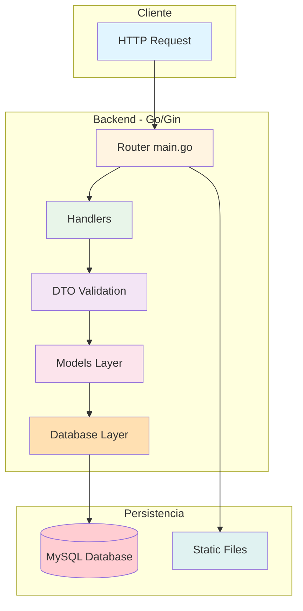
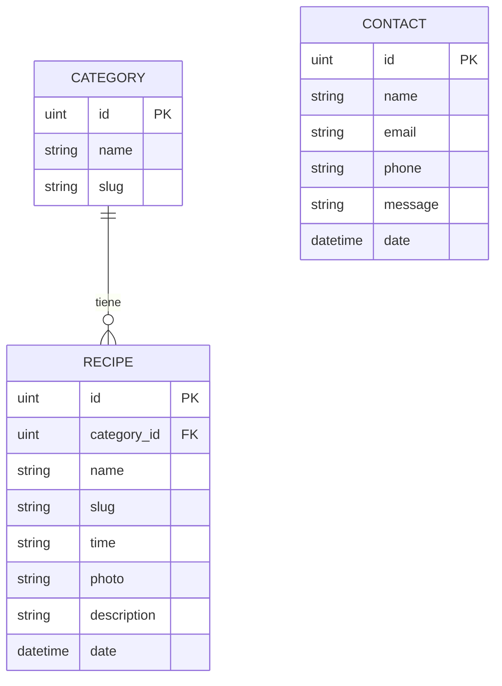

# 🚀 Fullstack Application

<div align="center">


*Una aplicación fullstack moderna con API RESTful en Go y frontend interactivo*

[Documentación](#-documentación) • [Reportar Bug](../../issues) • [Solicitar Feature](../../issues)

</div>

---

## 📖 Índice

- [Sobre el Proyecto](#-sobre-el-proyecto)
- [Stack Tecnológico](#️-stack-tecnológico)
- [Estructura del Proyecto](#-estructura-del-proyecto)
- [Inicio Rápido](#-inicio-rápido)
- [Documentación de la API](#-documentación-de-la-api)
- [Modelos de Datos](#-modelos-de-datos)
- [Desarrollo](#-desarrollo)
- [Características](#-características)
- [Roadmap](#-roadmap)
- [Contribuir](#-contribuir)
- [Licencia](#-licencia)
- [Contacto](#-contacto)

---

## 🎯 Sobre el Proyecto

Esta es una aplicación fullstack completa que incluye:

- **Backend API RESTful** construida con Go y Gin Framework
- **Base de datos MySQL** con ORM GORM
- **Sistema de gestión de categorías y recetas**
- **Arquitectura escalable** y mantenible
- **Hot reload** para desarrollo ágil

### ¿Qué hace esta aplicación?

Proporciona una plataforma para gestionar categorías, recetas y contactos con operaciones CRUD completas, generación automática de slugs, validación de datos y relaciones entre modelos.

---

## 🛠️ Stack Tecnológico

### Backend

<table>
<tr>
<td align="center" width="96">

<br>Go
</td>
<td align="center" width="96">

<br>Gin
</td>
<td align="center" width="96">

<br>GORM
</td>
<td align="center" width="96">

<br>MySQL
</td>
<td align="center" width="96">

<br>Air
</td>
</tr>
</table>

- **Lenguaje:** Go 1.24.0
- **Framework Web:** Gin 1.11.0
- **ORM:** GORM
- **Base de Datos:** MySQL 8.0
- **Hot Reload:** Air
- **Gestión de Env:** GoDotEnv
- **Slug Generation:** GoSimple/Slug

### Frontend
> 🚧 **Coming Soon** - Se documentará cuando esté implementado

---

## 📁 Estructura del Proyecto

```
fullstack-app/
├── 📂 backend/                 # Aplicación backend en Go
│   ├── 📂 database/            # Configuración de base de datos
│   │   └── database.go         # Conexión GORM a MySQL
│   ├── 📂 dto/                 # Data Transfer Objects
│   │   ├── category.go         # DTO para categorías
│   │   └── dto.go              # DTOs generales
│   ├── 📂 handlers/            # Controladores HTTP
│   │   └── Categories.go       # CRUD de categorías
│   ├── 📂 models/              # Modelos de datos
│   │   └── models.go           # Category, Recipe, Contact
│   ├── 📂 public/              # Archivos estáticos
│   ├── 📂 tmp/                 # Temporales de Air
│   ├── 📄 .air.toml            # Configuración hot reload
│   ├── 📄 .env                 # Variables de entorno (local)
│   ├── 📄 go.mod               # Dependencias Go
│   ├── 📄 go.sum               # Checksums
│   └── 📄 main.go              # Punto de entrada
├── 📄 .gitignore               # Archivos ignorados por Git
├── 📄 LICENSE                  # Licencia MIT
└── 📄 README.md                # Este archivo
```

---

## ⚡ Inicio Rápido

### Requisitos Previos

Asegúrate de tener instalado:

- [Go](https://golang.org/dl/) >= 1.24.0
- [MySQL](https://dev.mysql.com/downloads/) >= 8.0
- [Git](https://git-scm.com/)
- [Air](https://github.com/air-verse/air) (opcional, recomendado)

### Instalación

#### 1️⃣ Clonar el repositorio

```bash
git clone https://github.com/jjmartinmelero/fullstack-app.git
cd fullstack-app
```

#### 2️⃣ Configurar Backend

```bash
cd backend

# Instalar dependencias
go mod download

# Crear archivo .env
cp .env.example .env
# Edita .env con tus credenciales de MySQL
```

**Configuración `.env`:**

```env
DB_HOST=localhost
DB_PORT=3306
DB_USER=tu_usuario
DB_PASSWORD=tu_contraseña
DB_NAME=nombre_base_datos
```

#### 3️⃣ Ejecutar el Backend

**Con Air (desarrollo con hot reload):**
```bash
air
```

**Sin Air (modo estándar):**
```bash
go run main.go
```

El servidor estará disponible en: **http://localhost:1024**

Las migraciones de base de datos se ejecutan automáticamente al iniciar la aplicación.

---

## 📚 Documentación de la API

### 🔧 Endpoints Disponibles

**Base URL:** `http://localhost:1024`

#### Endpoints Generales

| Método | Endpoint | Descripción | Body |
|--------|----------|-------------|------|
| `GET` | `/` | Mensaje de bienvenida | - |
| `GET` | `/public/*` | Archivos estáticos | - |

#### Endpoints de Categorías

**Base URL:** `http://localhost:1024/api/v1/categories`

| Método | Endpoint | Descripción | Body | Response |
|--------|----------|-------------|------|----------|
| `GET` | `/api/v1/categories` | Listar todas las categorías | - | `200 OK` |
| `GET` | `/api/v1/categories/:id` | Obtener categoría por ID | - | `200 OK` / `404 Not Found` |
| `POST` | `/api/v1/categories` | Crear nueva categoría | `{name}` | `201 Created` / `409 Conflict` |
| `PUT` | `/api/v1/categories/:id` | Actualizar categoría | `{name}` | `200 OK` / `404 Not Found` |
| `DELETE` | `/api/v1/categories/:id` | Eliminar categoría | - | `200 OK` / `404 Not Found` |

### 📝 Ejemplos de Uso

#### GET - Listar todas las categorías

```bash
curl http://localhost:1024/api/v1/categories
```

**Respuesta:**
```json
{
  "status": "OK",
  "message": "Categories retrieved successfully",
  "data": [
    {
      "id": 1,
      "name": "Postres",
      "slug": "postres"
    },
    {
      "id": 2,
      "name": "Platos Principales",
      "slug": "platos-principales"
    }
  ]
}
```

#### GET - Obtener categoría por ID

```bash
curl http://localhost:1024/api/v1/categories/1
```

**Respuesta:**
```json
{
  "status": "OK",
  "message": "Category retrieved successfully",
  "data": {
    "id": 1,
    "name": "Postres",
    "slug": "postres"
  }
}
```

#### POST - Crear nueva categoría

```bash
curl -X POST http://localhost:1024/api/v1/categories \
  -H "Content-Type: application/json" \
  -d '{
    "name": "Ensaladas"
  }'
```

**Respuesta:**
```json
{
  "status": "OK",
  "message": "Category created successfully",
  "data": {
    "id": 3,
    "name": "Ensaladas",
    "slug": "ensaladas"
  }
}
```

> **Nota:** El slug se genera automáticamente a partir del nombre

#### PUT - Actualizar categoría

```bash
curl -X PUT http://localhost:1024/api/v1/categories/3 \
  -H "Content-Type: application/json" \
  -d '{
    "name": "Ensaladas Frescas"
  }'
```

**Respuesta:**
```json
{
  "status": "OK",
  "message": "Category updated successfully",
  "data": {
    "id": 3,
    "name": "Ensaladas Frescas",
    "slug": "ensaladas-frescas"
  }
}
```

#### DELETE - Eliminar categoría

```bash
curl -X DELETE http://localhost:1024/api/v1/categories/3
```

**Respuesta:**
```json
{
  "status": "OK",
  "message": "Category deleted successfully",
  "data": {
    "id": 3,
    "name": "Ensaladas Frescas",
    "slug": "ensaladas-frescas"
  }
}
```

### 🔴 Respuestas de Error

**Error 400 - Bad Request:**
```json
{
  "status": "ERROR",
  "message": "Invalid request body",
  "err": "Key: 'CategoryDto.Name' Error:Field validation for 'Name' failed on the 'required' tag"
}
```

**Error 404 - Not Found:**
```json
{
  "status": "ERROR",
  "message": "Category not found",
  "err": "record not found"
}
```

**Error 409 - Conflict:**
```json
{
  "status": "ERROR",
  "message": "Category already exists"
}
```

### 🏗️ Arquitectura Backend



---

## 🗄️ Modelos de Datos

### Category (Categoría)

```go
type Category struct {
    Id   uint   `json:"id"`
    Name string `gorm:"type:varchar(100);not null" json:"name"`
    Slug string `gorm:"type:varchar(100)" json:"slug"`
}
```

**Características:**
- ID auto-incremental
- Nombre único requerido
- Slug generado automáticamente
- Validación de duplicados

### Recipe (Receta)

```go
type Recipe struct {
    Id          uint      `json:"id"`
    CategoryId  uint      `json:"category_id"`
    Category    Category  `gorm:"foreignKey:CategoryId" json:"category"`
    Name        string    `gorm:"type:varchar(100);not null" json:"name"`
    Slug        string    `gorm:"type:varchar(100)" json:"slug"`
    Time        string    `gorm:"type:varchar(100);not null" json:"time"`
    Photo       string    `gorm:"type:varchar(100);not null" json:"photo"`
    Description string    `json:"description"`
    Date        time.Time `json:"date"`
}
```

**Características:**
- Relación con Category (Foreign Key)
- Campos multimedia (foto)
- Timestamps automáticos
- Slug auto-generado

### Contact (Contacto)

```go
type Contact struct {
    Id      uint      `json:"id"`
    Name    string    `gorm:"type:varchar(100);not null" json:"name"`
    Email   string    `gorm:"type:varchar(100);not null" json:"email"`
    Phone   string    `gorm:"type:varchar(100);not null" json:"phone"`
    Message string    `gorm:"type:text;not null" json:"message"`
    Date    time.Time `json:"date"`
}
```

**Características:**
- Formulario de contacto
- Validación de campos
- Fecha de envío automática

### Relaciones



---

## 👨‍💻 Desarrollo

### Flujo de Trabajo

#### Backend Development

1. **Iniciar servidor de desarrollo:**
   ```bash
   cd backend
   air
   ```

2. **Hacer cambios en el código** - Air recargará automáticamente

3. **Probar endpoints:**
   ```bash
   # Usar Postman, Insomnia, o curl
   curl http://localhost:1024/api/v1/categories
   ```

4. **Las migraciones se ejecutan automáticamente** al iniciar el servidor

### Convenciones de Código

#### Backend (Go)
- **Archivos:** `PascalCase.go` para handlers (ej: `Categories.go`)
- **Funciones públicas:** `PascalCase` (ej: `GetCategories`)
- **Funciones privadas:** `camelCase`
- **Variables:** `camelCase`
- **Constantes:** `UPPER_SNAKE_CASE`
- **Paquetes:** `lowercase`
- **Handlers:** Nombres descriptivos como `GetCategories`, `CreateCategory`

#### Validación
- Uso de DTOs para validación de datos
- Tags de validación con `binding:"required"`
- Manejo consistente de errores

---

## ✨ Características

### ✅ Implementadas

- [x] **API RESTful** completa para gestión de categorías
- [x] **Operaciones CRUD** completas con validación
- [x] **Generación automática de slugs** para SEO-friendly URLs
- [x] **Validación de duplicados** para evitar categorías repetidas
- [x] **Migraciones automáticas** con GORM AutoMigrate
- [x] **Conexión a MySQL** con GORM ORM
- [x] **Variables de entorno** para configuración segura
- [x] **Hot reload** con Air para desarrollo
- [x] **Arquitectura modular** con separación de capas
- [x] **Manejo de errores** consistente
- [x] **Servicio de archivos estáticos**
- [x] **Relaciones entre modelos** (Category → Recipe)
- [x] **Modelos preparados**: Category, Recipe, Contact

### 🚧 En Desarrollo

- [ ] Endpoints para Recipes
- [ ] Endpoints para Contacts
- [ ] Upload de fotos para recetas
- [ ] Frontend interactivo
- [ ] Autenticación JWT
- [ ] Tests unitarios e integración
- [ ] Docker & Docker Compose
- [ ] Documentación API con Swagger

---

## 🗺️ Roadmap

### Fase 1: Backend Core ✅
- [x] Estructura del proyecto
- [x] API RESTful para Categories
- [x] Conexión a base de datos
- [x] Validación de datos con DTOs
- [x] Modelos de datos (Category, Recipe, Contact)
- [x] Generación de slugs

### Fase 2: Backend Avanzado 🔄
- [ ] API para Recipes y Contacts
- [ ] Upload de imágenes para recetas  
- [ ] Búsqueda y filtrado
- [ ] Paginación
- [ ] Sistema de autenticación (JWT)
- [ ] Tests automatizados
- [ ] Documentación Swagger

### Fase 3: Frontend 📅
- [ ] Setup del proyecto frontend
- [ ] Diseño UI/UX
- [ ] Integración con API
- [ ] Gestión de categorías
- [ ] Gestión de recetas
- [ ] Formulario de contacto

### Fase 4: DevOps & Deploy 📅
- [ ] Dockerización
- [ ] Docker Compose para desarrollo
- [ ] CI/CD con GitHub Actions
- [ ] Deploy en producción
- [ ] Monitoreo y logs

---

## 🤝 Contribuir

¡Las contribuciones son bienvenidas! Si deseas contribuir:

1. **Fork** el proyecto
2. Crea tu **Feature Branch** (`git checkout -b feature/AmazingFeature`)
3. **Commit** tus cambios (`git commit -m 'Add some AmazingFeature'`)
4. **Push** a la rama (`git push origin feature/AmazingFeature`)
5. Abre un **Pull Request**

### Reportar Bugs

Si encuentras un bug, por favor abre un [issue](../../issues) con:
- Descripción clara del problema
- Pasos para reproducirlo
- Comportamiento esperado vs actual
- Screenshots (si aplica)

---

## 📄 Licencia

Distribuido bajo la licencia MIT. Ver [`LICENSE`](LICENSE) para más información.

```
MIT License - Copyright (c) 2025 Juan Jesús Martín Melero
```

---

## 💬 Contacto

**Juan Jesús Martín Melero**

- GitHub: [@jjmartinmelero](https://github.com/jjmartinmelero)
- Proyecto: [fullstack-app](https://github.com/jjmartinmelero/fullstack-app)

---

## 🙏 Agradecimientos

- [Gin Web Framework](https://gin-gonic.com/)
- [GORM](https://gorm.io/)
- [Air - Live reload](https://github.com/air-verse/air)
- [GoSimple/Slug](https://github.com/gosimple/slug)
- [Go Community](https://golang.org/)

---

<div align="center">

**⭐ Si este proyecto te resulta útil, considera darle una estrella ⭐**

Hecho con ❤️ por [Juan Jesús Martín Melero](https://github.com/jjmartinmelero)

</div>
