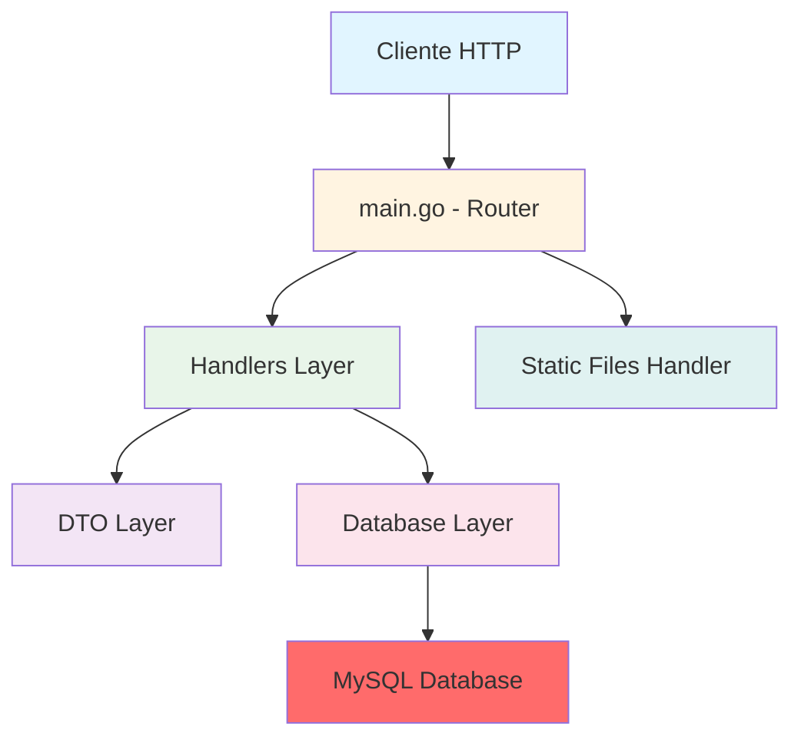

# 🚀 Backend API - Fullstack Application

<div align="center">


*Una API RESTful moderna construida con Go y Gin Framework*

</div>

---

## 📋 Tabla de Contenidos

- [Características](#-características)
- [Tecnologías](#️-tecnologías)
- [Estructura del Proyecto](#-estructura-del-proyecto)
- [Requisitos Previos](#-requisitos-previos)
- [Instalación](#-instalación)
- [Configuración](#️-configuración)
- [Uso](#-uso)
- [API Endpoints](#-api-endpoints)
- [Arquitectura](#-arquitectura)
- [Desarrollo](#-desarrollo)

---

## ✨ Características

- ✅ **API RESTful** completa con operaciones CRUD
- ✅ **Validación de datos** robusta en requests POST
- ✅ **Gestión de archivos** con upload de imágenes
- ✅ **Base de datos MySQL** con GORM ORM
- ✅ **Hot reload** con Air para desarrollo ágil
- ✅ **Arquitectura modular** con handlers y DTOs separados
- ✅ **Manejo de errores** consistente y descriptivo
- ✅ **Archivos estáticos** servidos desde `/public`
- ✅ **Variables de entorno** para configuración segura

---

## 🛠️ Tecnologías

| Tecnología | Versión | Propósito |
|-----------|---------|-----------|
| **Go** | 1.24.0 | Lenguaje de programación |
| **Gin** | 1.11.0 | Framework web de alto rendimiento |
| **GORM** | Latest | ORM para Go |
| **MySQL Driver** | Latest | Driver de base de datos MySQL |
| **GoDotEnv** | Latest | Gestión de variables de entorno |
| **Air** | Latest | Live reload para desarrollo |

### Dependencias Principales

```go
require (
    github.com/gin-gonic/gin v1.11.0
    github.com/joho/godotenv
    gorm.io/driver/mysql
    gorm.io/gorm
)
```

---

## 📁 Estructura del Proyecto

```
backend/
├── 📂 database/           # Configuración de base de datos
│   └── database.go        # Conexión y setup de GORM
├── 📂 dto/                # Data Transfer Objects
│   └── dto.go             # Estructuras de datos
├── 📂 handlers/           # Controladores HTTP
│   └── example.go         # Handlers de ejemplo
├── 📂 public/             # Archivos estáticos
│   └── uploads/images/    # Imágenes subidas
├── 📂 tmp/                # Archivos temporales de Air
├── 📄 .air.toml           # Configuración de Air
├── 📄 .env                # Variables de entorno (no versionado)
├── 📄 go.mod              # Dependencias del módulo
├── 📄 go.sum              # Checksums de dependencias
├── 📄 main.go             # Punto de entrada de la aplicación
└── 📄 README.md           # Este archivo
```

---

## 📦 Requisitos Previos

Antes de empezar, asegúrate de tener instalado:

- [Go](https://golang.org/dl/) >= 1.24.0
- [MySQL](https://dev.mysql.com/downloads/) >= 8.0
- [Air](https://github.com/air-verse/air) (opcional, para hot reload)

---

## 🚀 Instalación

### 1. Clonar el repositorio

```bash
git clone <repository-url>
cd fullstack-app/backend
```

### 2. Instalar dependencias

```bash
go mod download
```

### 3. Instalar Air (opcional, para desarrollo)

```bash
go install github.com/air-verse/air@latest
```

---

## ⚙️ Configuración

### Variables de Entorno

Crea un archivo `.env` en la raíz del directorio `backend`:

```env
# Configuración de Base de Datos
DB_HOST=localhost
DB_PORT=3306
DB_USER=your_db_user
DB_PASSWORD=your_db_password
DB_NAME=your_database_name
```

> ⚠️ **Importante:** Nunca commitees el archivo `.env` al repositorio. Ya está incluido en `.gitignore`.

---

## 💻 Uso

### Modo Desarrollo (con hot reload)

```bash
air
```

### Modo Producción

```bash
go run main.go
```

La API estará disponible en: **http://localhost:1024**

---

## 🌐 API Endpoints

### **Base URL:** `http://localhost:1024`

### Endpoints Principales

#### 🏠 Home
```http
GET /
```
**Respuesta:**
```json
{
  "status": "OK",
  "message": "Welcome to the API"
}
```

---

### 📚 API v1 - `/api/v1/`

#### 1. **GET** - Obtener ejemplo
```http
GET /api/v1/example
```
**Respuesta:**
```json
{
  "status": "OK",
  "message": "message get v2"
}
```

---

#### 2. **GET** - Obtener con parámetro
```http
GET /api/v1/example/:id
```
**Parámetros:**
- `id` (URL param) - ID del recurso

**Ejemplo:**
```http
GET /api/v1/example/123
```

**Respuesta:**
```json
{
  "status": "OK",
  "message": "Get - Id is : 123"
}
```

---

#### 3. **POST** - Crear ejemplo
```http
POST /api/v1/example
```
**Body (JSON):**
```json
{
  "email": "user@example.com",
  "password": "securepassword"
}
```

**Validaciones:**
- ✅ Email y password son **requeridos**
- ✅ JSON debe ser válido

**Respuesta exitosa (201):**
```json
{
  "status": "OK",
  "message": "Post - message post v2",
  "data": {
    "email": "user@example.com",
    "password": "securepassword"
  }
}
```

**Respuesta error (400):**
```json
{
  "status": "ERROR",
  "message": "Invalid data: <error details>"
}
```

**Respuesta error (422):**
```json
{
  "status": "ERROR",
  "message": "Email and password fields are required"
}
```

---

#### 4. **PUT** - Actualizar ejemplo
```http
PUT /api/v1/example/:id
```
**Parámetros:**
- `id` (URL param) - ID del recurso

**Respuesta:**
```json
{
  "status": "OK",
  "message": "Put - Id is : 123"
}
```

---

#### 5. **DELETE** - Eliminar ejemplo
```http
DELETE /api/v1/example/:id
```
**Parámetros:**
- `id` (URL param) - ID del recurso

**Respuesta:**
```json
{
  "status": "OK",
  "message": "Delete - Id is : 123"
}
```

---

#### 6. **GET** - Querystring
```http
GET /api/v1/example/querystring?id=123
```
**Query Params:**
- `id` - ID del recurso

**Respuesta:**
```json
{
  "status": "OK",
  "message": "Querystring - Id is : 123"
}
```

---

#### 7. **POST** - Upload de archivo
```http
POST /api/v1/example/upload
```
**Content-Type:** `multipart/form-data`

**Form Data:**
- `photo` (file) - Archivo de imagen

**Comportamiento:**
- El archivo se guarda en `public/uploads/images/`
- Nombre del archivo: `YYYY-MM-DD_HH-MM-SS.{extension}`

**Respuesta exitosa (201):**
```json
{
  "status": "OK",
  "message": "Upload - message upload v2",
  "data": {
    // File metadata
  }
}
```

**Respuesta error (400):**
```json
{
  "status": "ERROR",
  "message": "Invalid data: <error details>"
}
```

---

### 🚫 Ruta no encontrada
```http
ANY /*
```
**Respuesta (404):**
```json
{
  "status": "ERROR",
  "message": "Path not found"
}
```

---

## 🏗️ Arquitectura

### Capas de la Aplicación



### Componentes Principales

#### 1. **main.go** - Router y Configuración
- Inicialización del servidor Gin
- Definición de rutas
- Middleware y configuración global
- Servidor de archivos estáticos

#### 2. **handlers/** - Lógica de Negocio
- `Example_get`: Manejo de peticiones GET
- `Example_post`: Manejo de peticiones POST con validación
- `Example_put`: Manejo de peticiones PUT
- `Example_delete`: Manejo de peticiones DELETE
- `Example_querystring`: Manejo de query parameters
- `Example_upload`: Manejo de upload de archivos

#### 3. **dto/** - Data Transfer Objects
- `ExampleDto`: Estructura para validar y transferir datos
  ```go
  type ExampleDto struct {
      Email    string `json:"email"`
      Password string `json:"password"`
  }
  ```

#### 4. **database/** - Capa de Datos
- Conexión con MySQL usando GORM
- Carga de variables de entorno
- Configuración de DSN (Data Source Name)

---

## 👨‍💻 Desarrollo

### Modo Debug

El servidor está configurado en modo Debug por defecto:

```go
gin.SetMode(gin.DebugMode)
```

Para producción, cambia a:

```go
gin.SetMode(gin.ReleaseMode)
```

### Hot Reload con Air

Air detecta cambios en archivos `.go`, `.tpl`, `.tmpl`, `.html` y recarga automáticamente.

Configuración en `.air.toml`:
- Binary output: `./tmp/main.exe`
- Build command: `go build -o ./tmp/main.exe .`
- Delay: 1000ms
- Excluye: `assets/`, `tmp/`, `vendor/`, `testdata/`, archivos `*_test.go`

### Agregar Nuevos Endpoints

1. **Crear handler** en `handlers/`:
```go
func NewHandler(c *gin.Context) {
    c.JSON(http.StatusOK, gin.H{
        "status": "OK",
        "message": "Your message",
    })
}
```

2. **Registrar ruta** en `main.go`:
```go
router.GET(prefix+"newroute", handlers.NewHandler)
```

### Crear Nuevos DTOs

1. Agregar estructura en `dto/dto.go`:
```go
type NewDto struct {
    Field1 string `json:"field1"`
    Field2 int    `json:"field2"`
}
```

2. Usar en handlers:
```go
var dto dto.NewDto
if err := c.BindJSON(&dto); err != nil {
    // Handle error
}
```

---

## 📝 Convenciones de Código

- **Nombres de archivos:** snake_case
- **Nombres de funciones:** PascalCase con prefijo descriptivo
- **Nombres de variables:** camelCase
- **Rutas API:** Versionadas (`/api/v1/`)
- **Respuestas JSON:** Estructura consistente con `status` y `message`

---

## 📄 Licencia

Este proyecto está disponible bajo la licencia que especifiques.

---

## 👥 Autor

Creado con ❤️ para demostrar las capacidades de Go y Gin Framework.

---

<div align="center">

**¿Preguntas o sugerencias?** ¡Abre un issue!

⭐ Si te gusta este proyecto, dale una estrella ⭐

</div>
